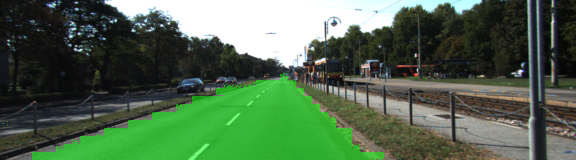
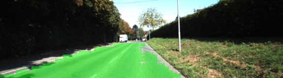
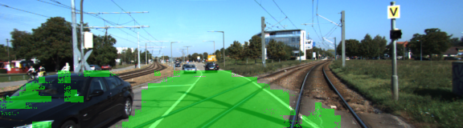
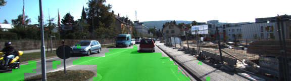

# Semantic Segmentation
### Introduction
In this project, you'll label the pixels of a road in images using a Fully Convolutional Network (FCN).

### Setup
##### Frameworks and Packages
 - [Python 3](https://www.python.org/)
 - [TensorFlow](https://www.tensorflow.org/)
 - [NumPy](http://www.numpy.org/)
 - [SciPy](https://www.scipy.org/)
##### Dataset
Download the [Kitti Road dataset](http://www.cvlibs.net/datasets/kitti/eval_road.php) from [here](http://www.cvlibs.net/download.php?file=data_road.zip).  Extract the dataset in the `data` folder.  This will create the folder `data_road` with all the training a test images.

### Start
##### Implement
Implement the code in the `main.py` module indicated by the "TODO" comments.
The comments indicated with "OPTIONAL" tag are not required to complete.
##### Run
Run the following command to run the project:
```
python main.py
```

### Results

Where it succeeded:





Where it failed:





For other results, see `./runs` directory.

### Future Work

- More experiments and perhaps more epochs with smaller batch are needed to smoothen the results.
- More classes to classify.

### Notes

When running the script with NVidia GeForce 1060, the GPU ran out of memory. Titan Xp seemed to be the minimum GPU requirement to run the script locally.